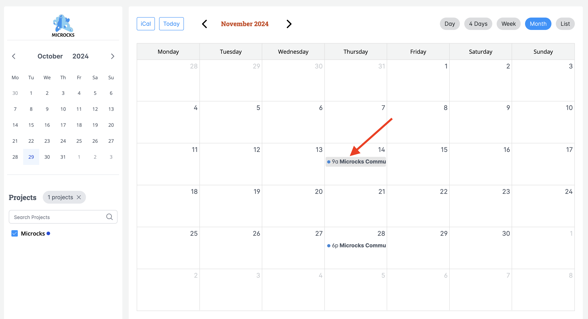
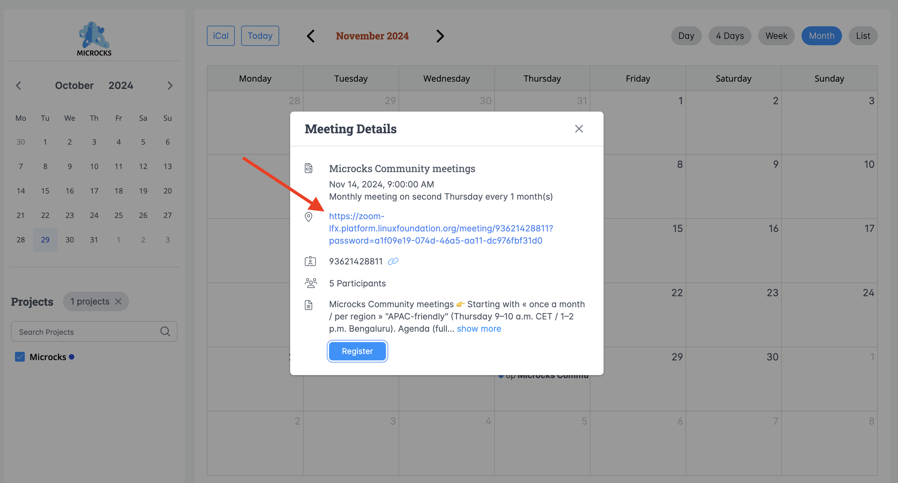
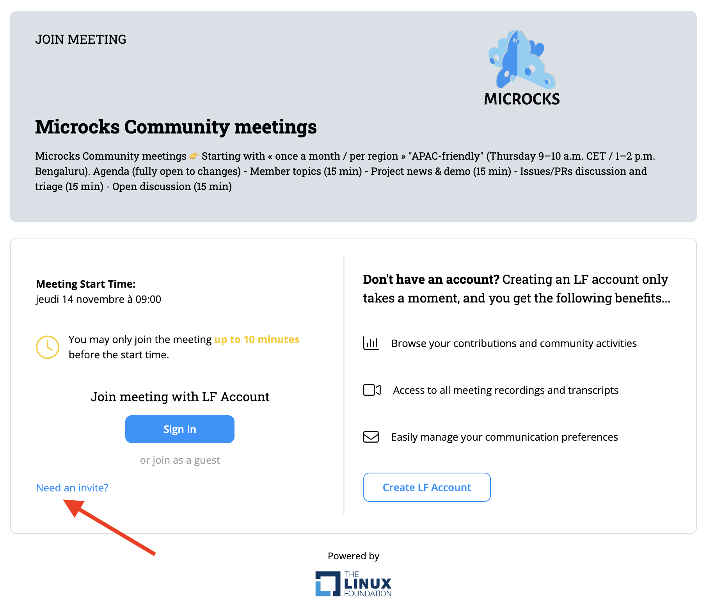
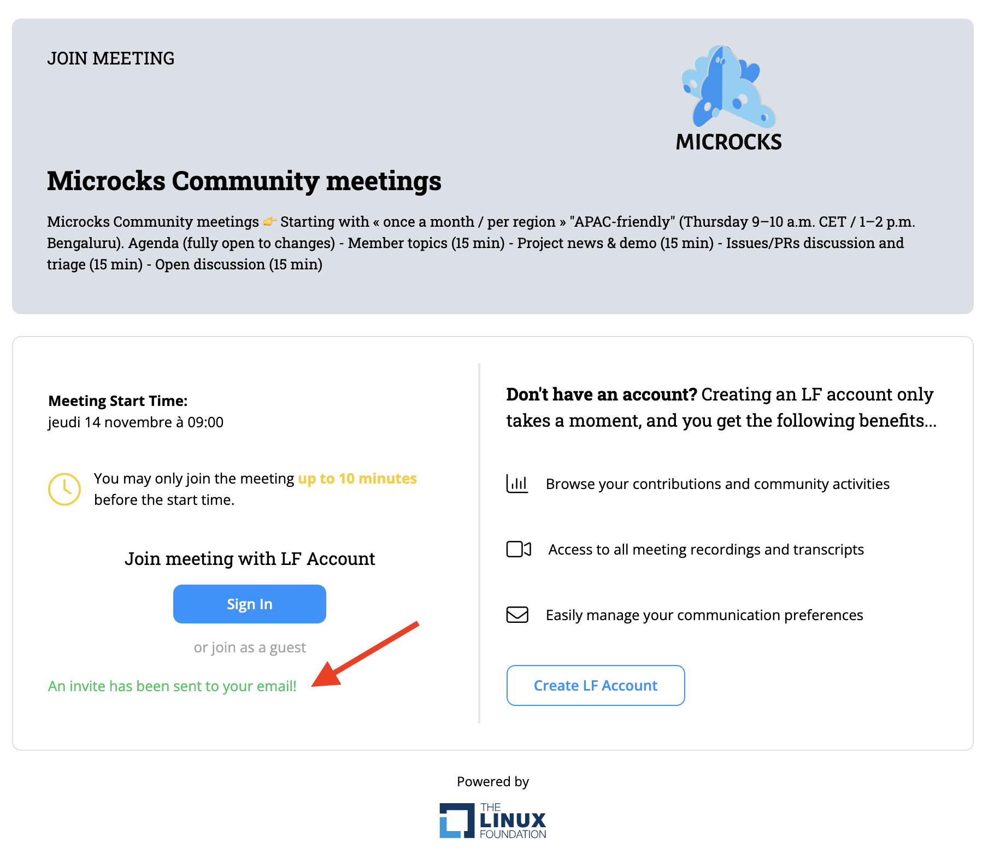
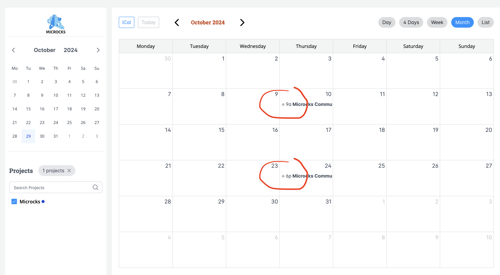

# Joining Microcks Community Meetings: A Step-by-Step Guide

[Microcks](https://microcks.io/) hosts two monthly community meetings, tailored for different time zones. Here’s how to join and participate:

## 1. Meeting Schedule
- **APAC-friendly Meeting:** Second Thursday of each month  
  - Time: 9–10 a.m. CET / 1–2 p.m. Bengaluru
- **America-friendly Meeting:** Fourth Thursday of each month  
  - Time: 6–7 p.m. CET / 1–2 p.m. EST / 9–10 a.m. PST

## 2. Find the Meeting Agenda
Visit our [meeting agenda page](https://zoom-lfx.platform.linuxfoundation.org/meetings/microcks?view=month) and choose the meeting that best fits your schedule (or join both!):

## 3. Get Your Zoom Invite
   - Click on the meeting in the agenda:
   
   ℹ️ Please note, you can also click the "Register" button at the bottom to jump directly to the registration step, skipping a step.
   
   - In the meeting details, select the Zoom link:
   
   
   
   - Click on “Need an invite?” and complete the required fields:
   
   ℹ️ Please note, it’s highly recommended that you use the same email as your LFID(\*) account (or the one you'll use if creating a new LFID) when you request the meeting invitation.

   (\*) Your LFID refers to your account at [OpenProfile](https://openprofile.dev) or [LFX](https://lfx.linuxfoundation.org/) 💡 Learn how to create an account on Linux Foundation-managed service 👉 https://docs.linuxfoundation.org/lfx/sso/create-an-account

   - Submit your request to receive an invitation email:
   

## 4. Add to Your Calendar
   - Check your email for the invite and add the meeting to your calendar,
   - For all future meetings, choose “This and following events”,
   - You’ll be able to join the meeting 10 minutes early by clicking on the Zoom link in your calendar.

**✅ Looking forward to seeing you there! 🙌**

ℹ️ Please note, if the dates appear in grey in the agenda:

👉 You’ll need to select upcoming months to view the next scheduled meetings and register, as outlined above. Clicking on a grey (past date) will only redirect you to the Zoom recording of that previous meeting.