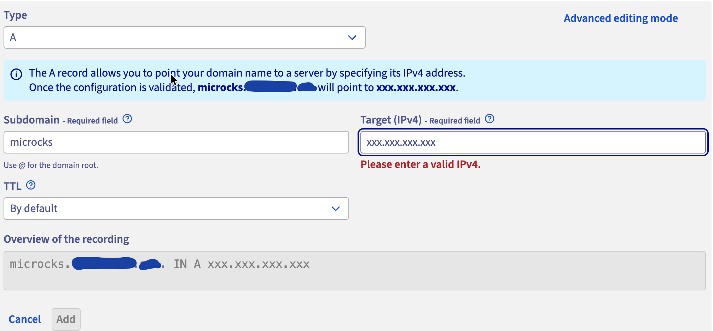

# Deploy Microcks on OVHcloud

## Overview

This guide provides a step-by-step approach to deploy **Microcks** on an **OVHcloud Managed Kubernetes Service (MKS)** cluster. It includes setting up **Gateway API** with **OVHcloud Public Cloud Load Balancer**.

## Prerequisites

Ensure the following tools are installed on your local system:

1. **OVHcloud CLI:** [Install Guide](https://github.com/ovh/ovhcloud-cli/#installation)
2. **kubectl (Kubernetes CLI):** [Install Guide](https://kubernetes.io/docs/tasks/tools/#kubectl)
3. **Helm:** [Install Guide](https://helm.sh/docs/intro/install/)
4. An active OVHcloud account
5. An OVHcloud Public Cloud project
6. An OVHcloud API credential with sufficient permissions
7. A Domain Name (optional) if you want to set up a custom DNS

## 1. Authenticate and configure the OVHcloud Public Cloud project

OVHcloud CLI requires authentication to be able to make API calls. Run the following commands to export the needed enviroment variables. Replace <application-key>, <application-secret>, <consumer-key> and <public-cloud-project-id> with your information.

```sh
export OVH_ENDPOINT="ovh-eu"
export OVH_APPLICATION_KEY="<application-key>"
export OVH_APPLICATION_SECRET="<application-secret>"
export OVH_CONSUMER_KEY="<consumer-key>"
export OVH_CLOUD_PROJECT_SERVICE="<public-cloud-project-id>"
```

Alternatively, you can use the `ovhcloud login` command to authenticate interactively or [use a configuration file](https://github.com/ovh/ovhcloud-cli/blob/main/doc/authentication.md#configuration-file).

## 2. Create and configure an OVHcloud MKS cluster

### 2.1 Create an OVHcloud MKS cluster

Configure the Kubernetes cluster information:

Define your cluster configuration:

```sh
export CLUSTER_NAME="microcks"
export REGION="GRA9"
export PLAN="free"
```

Create the Kubernetes cluster:

```sh
CLUSTER_ID=$(ovhcloud cloud mks create --name $CLUSTER_NAME --region $REGION --plan $PLAN | grep -oE '[0-9a-f-]{36}')
```

Wait for 2-3 minutes for the cluster to be provisioned.

Check the status of the Kubernetes cluster:

```sh
ovhcloud cloud mks get $CLUSTER_ID
```

For production usage, consider using a `standard` plan instead of the `free` plan.

### 2.2 Create the MKS node pool

Microcks is composed of several Kubernetes workloads, including the Microcks application, Keycloak and its PostgreSQL instance, MongoDB and the Postman runtime.

For a small installation, a node pool with three general-purpose nodes is a reasonable starting point.

Define your node pool configuration:

```sh
export NODEPOOL_NAME="microcks-np"
export NODE_FLAVOR="b3-8"
```

Create the node pool:

```sh
NP_ID=$(ovhcloud cloud mks nodepool create $CLUSTER_ID --flavor-name $NODE_FLAVOR --name $NODEPOOL_NAME --desired-nodes 3 --min-nodes 2 --max-nodes 3 | grep -oE '[0-9a-f-]{36}')
```

Wait for 3-4 minutes for the node pool to be provisioned.

Check the status of the node pool:

```sh
ovhcloud cloud mks nodepool get $CLUSTER_ID $NP_ID
```

### 2.3 Generate the kubeconfig and configure kubectl

Once the cluster and node pool are ready, generate the Kubernetes configuration:

```sh
ovhcloud cloud mks kubeconfig generate $CLUSTER_ID > microcks.yaml
```

Configure the kubectl CLI with the generated kubeconfig:

```sh
export KUBECONFIG=$(pwd)/microcks.yaml
```

Display the node pool and the nodes information:

```sh
kubectl get np
kubectl get nodes
```

You should see several nodes in the `Ready` state.

## 3. Deploy Envoy Gateway API Controller

Envoy Gateway implements the Kubernetes Gateway API and creates an Envoy proxy infrastructure for each Gateway.

### 3.1 Install Envoy Gateway

Install Envoy Gateway using Helm:

```sh
helm install envoy-gateway oci://docker.io/envoyproxy/gateway-helm -n envoy-gateway-system --create-namespace
```

Check the installation:

```sh
kubectl get pods -n envoy-gateway-system
```

All the pods should be in the `Running` state.

### 3.2 Deploy the Envoy Gateway Class

A `GatewayClass` defines which controller will manage your Gateways.
Create a `GatewayClass` for Envoy Gateway:

```sh
cat <<EOF | kubectl apply -f -
apiVersion: gateway.networking.k8s.io/v1
kind: GatewayClass
metadata:
  name: envoy
spec:
  controllerName: gateway.envoyproxy.io/gatewayclass-controller
EOF
```

Check the envoy Gateway Class is created:

```sh
kubectl get gatewayclass
--- OUTPUT ---
NAME    CONTROLLER                                      ACCEPTED   AGE
envoy   gateway.envoyproxy.io/gatewayclass-controller   True       3s
```

### 3.3 Install cert-manager for SSL Certificates

```sh
helm repo add jetstack https://charts.jetstack.io
helm repo update
helm install cert-manager jetstack/cert-manager --namespace cert-manager --create-namespace --set crds.enabled=true --set config.gatewayAPI.enabled=true
```

Create `ClusterIssuer` for Let's Encrypt:

```sh
cat <<EOF | kubectl apply -f -
apiVersion: cert-manager.io/v1
kind: ClusterIssuer
metadata:
  name: letsencrypt-prod-microcks
spec:
  acme:
    server: https://acme-v02.api.letsencrypt.org/directory
    email: <your-email@example.com>   # Update with your email address
    privateKeySecretRef:
      name: letsencrypt-prod-microcks
    solvers:
    - http01:
        gatewayHTTPRoute:
          parentRefs:
            - name: microcks-gateway
              namespace: microcks
              group: gateway.networking.k8s.io
              kind: Gateway
EOF
```

### 3.4 Create the Envoy Gateway

Microcks will reference a Gateway named `microcks-gateway`.

Create the namespace:

```sh
kubectl create namespace microcks
```

Create the `Gateway`:

```sh
cat <<EOF | kubectl apply -f -
apiVersion: gateway.networking.k8s.io/v1
kind: Gateway
metadata:
  name: microcks-gateway
  namespace: microcks
  annotations:
    cert-manager.io/cluster-issuer: letsencrypt-prod-microcks
spec:
  gatewayClassName: envoy

  listeners:
    - name: microcks-http
      hostname: microcks.<YOUR_DOMAIN>.com
      protocol: HTTP
      port: 80
      allowedRoutes:
        namespaces:
          from: Same

    - name: microcks-https
      hostname: microcks.<YOUR_DOMAIN>.com
      protocol: HTTPS
      port: 443
      tls:
        mode: Terminate
        certificateRefs:
          - name: microcks-tls
      allowedRoutes:
        namespaces:
          from: Same

    - name: microcks-grpc
      hostname: microcks-grpc.<YOUR_DOMAIN>.com
      protocol: TLS
      port: 443
      tls:
        mode: Passthrough
      allowedRoutes:
        namespaces:
          from: Same

    - name: keycloak-http
      hostname: keycloak.<YOUR_DOMAIN>.com
      protocol: HTTP
      port: 80
      allowedRoutes:
        namespaces:
          from: Same

    - name: keycloak-https
      hostname: keycloak.<YOUR_DOMAIN>.com
      protocol: HTTPS
      port: 443
      tls:
        mode: Terminate
        certificateRefs:
          - name: keycloak-tls
      allowedRoutes:
        namespaces:
          from: Same
EOF
```

Check the envoy Gateway is created and programmed:

```sh
kubectl get gateway -n microcks
--- OUTPUT ---
NAME               CLASS   ADDRESS         PROGRAMMED   AGE
microcks-gateway   envoy   xx.xx.xx.xx.    True         3m49s
```

At this stage, the Gateway should be `Accepted=True` and `Programmed=True`, wait a few minutes for the Gateway to be programmed and the OVHcloud Public Cloud Load Balancer to be provisioned.

### 3.5 Configure DNS

Get the external address assigned to the Gateway:

```sh
export GATEWAY_IP=$(kubectl get gateway microcks-gateway \
  -n microcks \
  -o jsonpath='{.status.addresses[0].value}')

echo $GATEWAY_IP
--- OUTPUT ---
xx.xx.xx.xx
```

If you are using a custom domain, create the following DNS records:

```sh
microcks.<YOUR_DOMAIN>.com       A    <GATEWAY_IP>
microcks-grpc.<YOUR_DOMAIN>.com  A    <GATEWAY_IP>
keycloak.<YOUR_DOMAIN>.com       A    <GATEWAY_IP>
```

You can do it easily at OVHcloud in the Domain names management console if you have your domain registered with OVHcloud:



After the creation, wait a little bit for the DNS propagation to be completed. You can check it with the following command:

```sh
dig keycloak.<YOUR-DOMAIN>.com +noall +answer
dig microcks.<YOUR-DOMAIN>.com +noall +answer
dig microcks-grpc.<YOUR_DOMAIN>.com +noall +answer
```

Or, if you don't have a custom domain, you can use a free domain by using `nip.io` for your domain names, such as:

```
keycloak.<INGRESS_IP>.nip.io
microcks.<INGRESS_IP>.nip.io
```

## 4. Install Microcks using Helm

### 4.1 Add Microcks Helm Repository

```sh
helm repo add microcks https://microcks.io/helm/
helm repo update
```

### 4.2 Create the configuration file for Microcks

Create the `microcks_values.yaml` file with the configuration below. Replace the YOUR-DOMAIN placeholder with your actual value.

```sh
cat > microcks_values.yaml <<EOF
appName: microcks

ingresses: false
gatewayRoutes: true

gatewayRefName: microcks-gateway
gatewayRefNamespace: microcks
gatewayRefSectionName: microcks-https
grpcGatewayRefSectionName: microcks-grpc

microcks:
  url: microcks.<YOUR_DOMAIN>.com
  ingressSecretRef: microcks-tls
  generateCert: false

  grpcEnableTLS: true

keycloak:
  url: keycloak.<YOUR_DOMAIN>.com
  privateUrl: http://microcks-keycloak.microcks.svc.cluster.local:8080
  ingressSecretRef: keycloak-tls
  generateCert: false

  gatewayRefName: microcks-gateway
  gatewayRefNamespace: microcks
  gatewayRefSectionName: keycloak-https
EOF
```

### 4.3 Deploy Microcks

```sh
helm install microcks microcks/microcks -n microcks -f microcks_values.yaml --create-namespace
```

### 4.4 Verify Microcks Pod Status

Check that the Microcks pods are running:

```sh
kubectl get pods -n microcks
--- OUTPUT ---
NAME                                           READY   STATUS    RESTARTS       AGE
microcks-7f9f994fbc-jd7pb                      1/1     Running   0              19m
microcks-keycloak-5cf68c6b65-xjr6n             1/1     Running   3 (3m1s ago)   19m
microcks-keycloak-postgresql-6665b755f-zjdrl   1/1     Running   0              19m
microcks-mongodb-7ddff9f544-8rdcx              1/1     Running   0              19m
microcks-postman-runtime-5699859b86-58mr7      1/1     Running   0              19m
```

Wait until all pods are in the `Running` state and containers are ready.


### 4.5 Check HTTPRoutes

```sh
kubectl get httproute -n microcks
--- OUTPUT ---
NAME                HOSTNAMES                    AGE
microcks            ["microcks.<YOUR_DOMAIN>.com"]   3m34s
microcks-keycloak   ["keycloak.<YOUR_DOMAIN>.com"]   3m34s
```

Microcks is now available at: https://microcks.<YOUR-DOMAIN>.com.
gRPC mock service is available at: https://microcks-grpc.YOUR-DOMAIN.com.
Keycloak is available at: https://keycloak.<YOUR-DOMAIN>.com.

🎉 Congratulations! You have successfully deployed Microcks on OVHcloud MKS. Now, you can start using Microcks to mock and test your APIs seamlessly in your cloud environment.

## Cleanup (If Needed)

To clean up resources:

1. Delete the MKS cluster:

```sh
ovhcloud cloud mks delete $CLUSTER_ID
```
It will delete the cluster and all associated resources, including node pools, load balancers, and ingress controllers.

2. Delete the DNS records you created for your domain.

## Improvements

This guide can be improved by implementing the following enhancements:
* Deploy the PostgreSQL DB on an **OVHcloud Managed Database** service instead of using the default PostgreSQL deployment in the Microcks Helm chart. 
* Deploy the MongoDB on an **OVHcloud Managed Database** service instead of using the default MongoDB deployment in the Microcks Helm chart.

This will provide better performance, scalability, and reliability for your Microcks installation.
